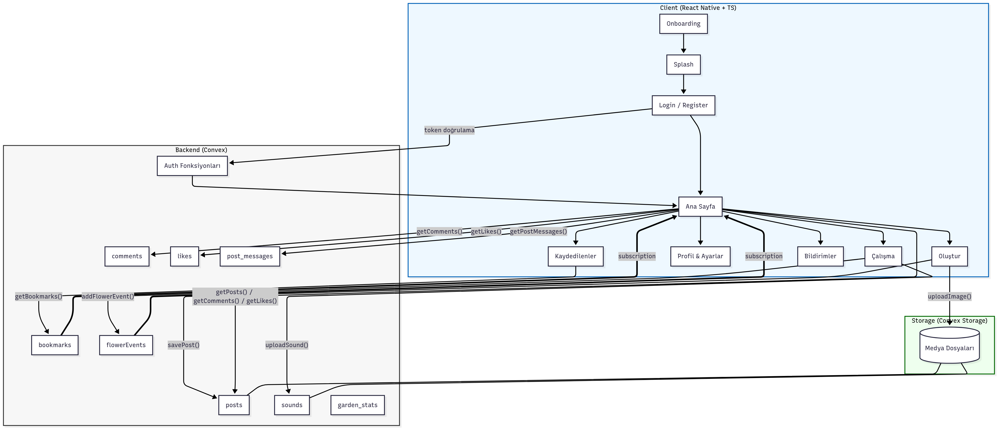
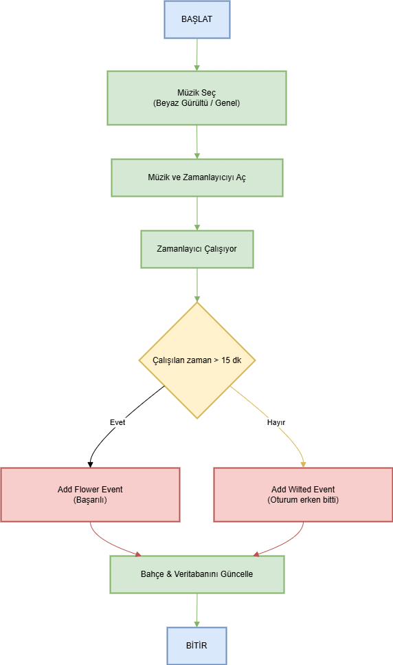
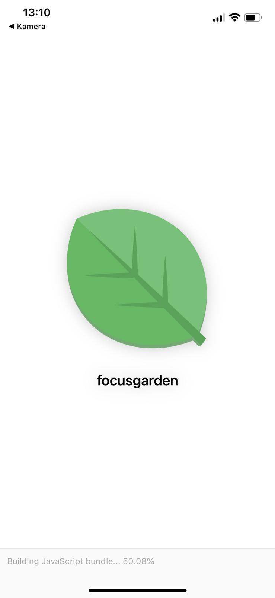
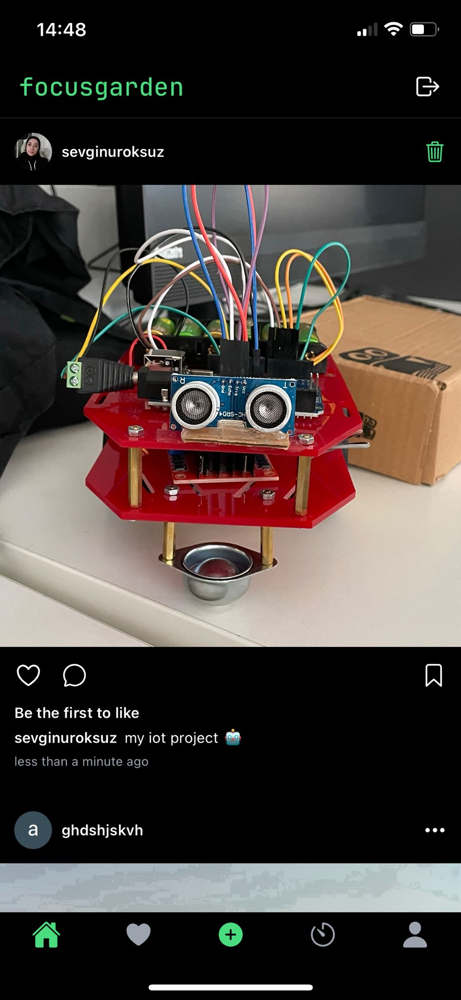
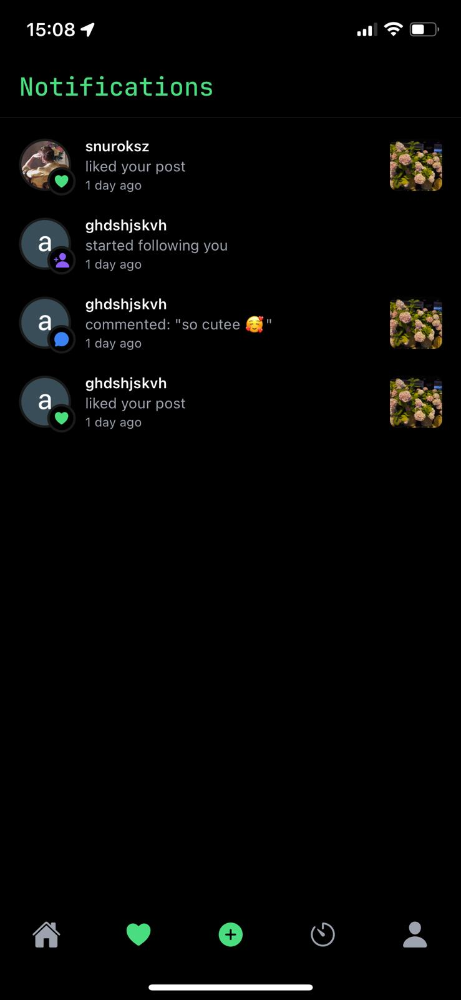
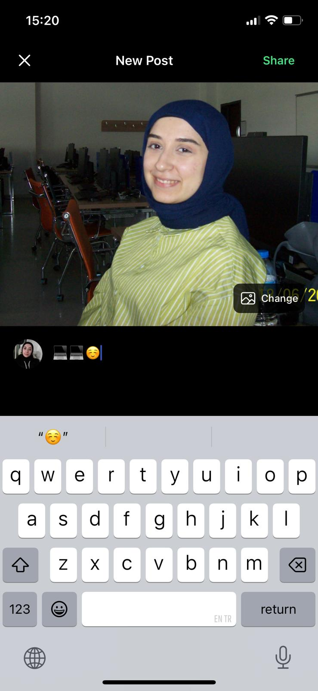
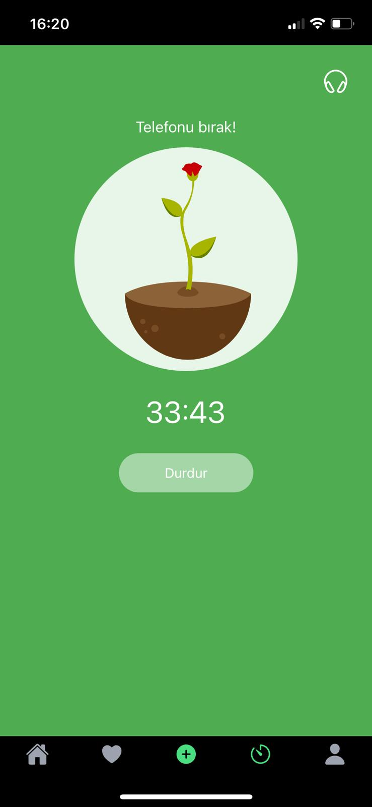
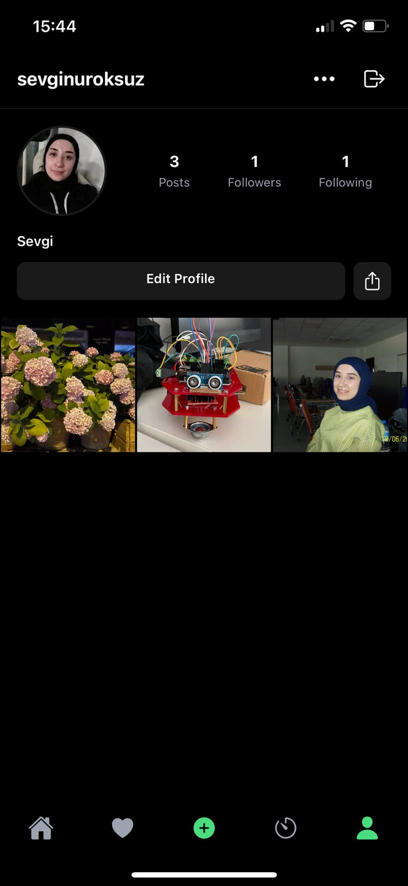
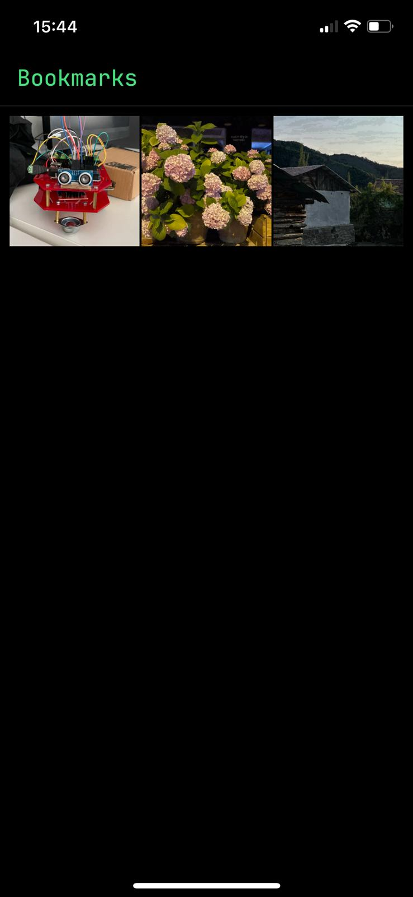
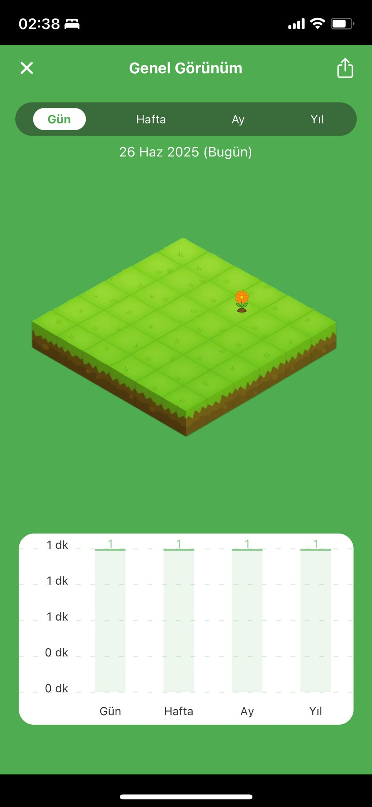

# FocusGarden

React Native tabanlı bir verimlilik uygulaması: Pomodoro tekniğini oyunlaştırarak kullanıcıların odaklandıkları süreyi kaydeder ve sanal bir çiçek bahçesine dönüştürerek motivasyon sağlar.

---

## İçindekiler

* [Proje](#proje)
* [Mimari ve Akış Şeması](#mimari-ve-akış-şeması)
* [Özellikler](#özellikler)
* [Ekran Açıklamaları](#ekran-açıklamaları)
* [Kurulum](#kurulum)
* [Kullanım](#kullanım)
* [Linkler](#linkler)
* [Lisans](#lisans)
* [Katkıda Bulunanlar](#katkıda-bulunanlar)
* [İletişim](#iletişim)

---

## Proje

**FocusGarden**, kullanıcıların odak sürelerini artırmayı hedefleyen, Pomodoro temelli bir mobil uygulamadır. Her çalışma seansı sonunda sanal bahçenize çiçekler eklenir veya kuruyan çiçekler görünür; böylece görsel ilerleme motivasyonunuzu pekiştirir.

---

## Mimari ve Akış Şeması

| Bölüm                   | Görsel                                                                                                                                                                              | Açıklama                                                                                                                                                                                                                          |
|-------------------------|-------------------------------------------------------------------------------------------------------------------------------------------------------------------------------------|-----------------------------------------------------------------------------------------------------------------------------------------------------------------------------------------------------------------------------------|
| **Mimari Diyagram**     | <p align="center"></p>                                                | Uygulamanın React Native frontend’inden C# backend’ine, Convex veri tabanından bulut servislerine kadar uçtan uca veri akışını ve bileşenler arası entegrasyonu detaylı şekilde gösterir.                                         |
| **Algoritma Akış Şeması** | <p align="center"></p>                                     | Zamanlayıcı seansının başlatılmasından sanal çiçeğin kademeli açılım animasyonuna ve Convex’e veri kaydına kadar tüm işlem adımlarını, karar noktalarını ve hata durumlarındaki yönlendirmeleri adım adım görselleştirir.          |


---

## Özellikler

* **Zamanlayıcı**: Çalışma süresini kaydeden ve ilerlemeyi dinamik animasyonlarla motive edici bir şekilde görselleştiren zamanlayıcı kısmı.
* **Çiçek Bahçesi**: Seans sonuçlarına göre çiçek ekleme animasyonları.
* **Beyaz Gürültü Desteği**: Odağa odaklanmayı kolaylaştıran ses oynatıcı.
* **İlerleme Görselleştirme**: Günlük/haftalık/aylık çalışma grafikleri.
* **Profil ve Yer İşaretleri**: Kullanıcı bilgileri, kaydedilen gönderiler ve paylaşımlar.

---

## Ekran Açıklamaları

---
| No | Ekran                 | Görsel                                                                                               | Açıklama                                                                                                                                                                                                                         |
|----|-----------------------|------------------------------------------------------------------------------------------------------|----------------------------------------------------------------------------------------------------------------------------------------------------------------------------------------------------------------------------------|
| 0  | Açılış Ekranı (Splash) | <p align="center"></p>                  | - Uygulama ilk açıldığında görünen ekran.<br>- Logo animasyonu ve yükleniyor göstergesi ile kullanıcı deneyimini zenginleştirir.<br>- Yükleme tamamlandığında otomatik olarak Ana Ekran’a yönlendirir.                                 |
| 1  | Ana Ekran (Home)      | <p align="center"></p>                 | - Takip edilen kullanıcıların paylaşımları kronolojik veya önerilen sırayla listelenir.<br>- Her gönderide profil, zaman damgası, metin/görsel içeriği ve “beğen”, “yorum yap” ile “kaydet” butonları bulunur. <br>- Yeni içerikler gerçek zamanlı güncellenir ve sonsuz kaydırma ile daha fazla gönderi yüklenir. |
| 2  | Bildirim Ekranı (Notification)   | <p align="center"></p>            | - Takipçi etkileşimleri, beğeni/yorum bildirimlerinin kronolojik olarak gerçek zamanlı listelendiği ekran.
| 3  | Oluştur (Create)      | <p align="center"></p>       | - Kullanıcılar fotoğraf ekleyerek yeni gönderi oluşturur; görsel düzenleme seçenekleri, etiket ekleme ve paylaşım butonuyla içeriğini anında akışa dahil edebilir.                      |
| 4  | Çalışma Ekranı (Timer)   | <p align="center"></p>            | - Seans ilerledikçe sanal çiçeğiniz kademeli olarak açılır; animasyonla tomurcuktan tam çiçeğe dönüşüm izlenir.<br>- Seans ilerledikçe sanal çiçeğiniz kademeli olarak açılır; animasyonla tomurcuktan tam çiçeğe dönüşüm izlenir.<br>- Sayısal gösterge, geçen süreyi net şekilde gösterir. <br>- Seans başında seçilmiş beyaz gürültü veya kullanıcı ses dosyası otomatik oynatılır; ses kontrol butonuyla açma/kapatma ve ses düzeyi ayarlanabilir. |
| 5  | Profil (Profile)      | <p align="center"></p>          | - Profil kısmında kullanıcı adı, profil fotoğrafı, gönderi, takipçi ve takip edilen sayıları tek bakışta gösterilir ve üstteki çıkış yap butonuyla profilden güvenli bir şekilde çıkış yapılabilir.<br>- Düzenleme penceresinde adınızı ve biyografinizi girip “Save Changes” butonuna tıklayarak hızlıca güncelleme yapabilirsiniz.               |
| 6  | Yer İşaretleri (Bookmarks) | <p align="center"></p>     | - Profil ekranından “Bookmarks” seçeneğine tıklanıldığında kaydedilen paylaşımlar ızgara düzeniyle görüntülenir.<br>- Bu ekran sayesinde beğendiğiniz içeriklere hızlıca erişip yönetebilirsiniz.     |
| 7  | Profil Bahçesi (Garden)    | <p align="center"></p>        | - Profil ekranından “Garden” seçeneğine dokunulduğunda aylık sanal bahçe görünümü açılır; her gün için ayrılmış kareler ızgara düzeninde gösterilir.Üstte Gün/Hafta/Ay/Yıl sekmeleriyle farklı zaman dilimlerinde odaklanma sürelerinizi seçebilir, alttaki grafik alanında ilgili döneme ait toplam çalışma dakikalarını görebilirsiniz.                                        |

---

## Kurulum

1. Depoyu klonlayın:

   ```bash
   git clone https://github.com/sevginuroksuz/focusgarden.git
   cd focusgarden
   ```
2. Bağımlılıkları yükleyin:

   ```bash
   npm install
   ```
3. Uygulamayı başlatın:

   ```bash
   npm start
   # veya Expo ile
   expo start
   ```

---

## Kullanım

Aşağıdaki adımlar ile tüm özellikleri kullanabilirsiniz:

1. **Zamanlayıcı Kontrolü**

   * Seans ilerledikçe sanal çiçeğiniz kademeli olarak açılır; animasyonla tomurcuktan tam çiçeğe dönüşüm izlenir.
   * Sayısal gösterge, geçen süreyi net şekilde gösterir.
   * Seans başında seçilmiş beyaz gürültü veya kullanıcı ses dosyası otomatik oynatılır; ses kontrol butonuyla açma/kapatma ve ses düzeyi ayarlanabilir.

2. **Çiçek Bahçesi**

   * Seans tamamlandığında otomatik olarak bahçenize çiçek eklenir.
   * **Bahçe** sekmesinde günlük, haftalık ve aylık ilerlemenizi inceleyin.

3. **Profil Yönetimi**

   * **Profil** sekmesinden kullanıcı adı, toplam odak süresi, tamamlanan seans sayısı ve hedef ilerlemenizi görüntüleyin.
   * Çubuk grafik ile günlük, haftalık, aylık ve yıllık hedef takibini yapın.

4. **Yer İşaretleri (Bookmarks)**

   * Önemli veya beğendiğiniz gönderileri kaydedip **Yer İşaretleri** sekmesinde listeleyin.

5. **Paylaşım**

   * Seans özetlerinizi veya kazandığınız rozetleri uygulamada gönderi olarak paylaşabilirsiniz.

---

## Linkler

* **GitHub Depo:** [https://github.com/sevginuroksuz/focusgarden](https://github.com/sevginuroksuz/focusgarden)
* **YouTube Tanıtım Videosu:** [https://youtu.be/YOUR\_VIDEO\_ID](https://youtu.be/YOUR_VIDEO_ID)

---

## Lisans

Bu proje [MIT Lisansı](LICENSE) ile lisanslanmıştır.

---

## Katkıda Bulunanlar
* Sevgi Nur Öksüz (Proje sahibi ve baş geliştirici)
* Katkılarınız için pull request ve issue’ları bekliyoruz.

---

## İletişim

Sevgi Nur Öksüz – GitHub: [sevginuroksuz](https://github.com/sevginuroksuz)
